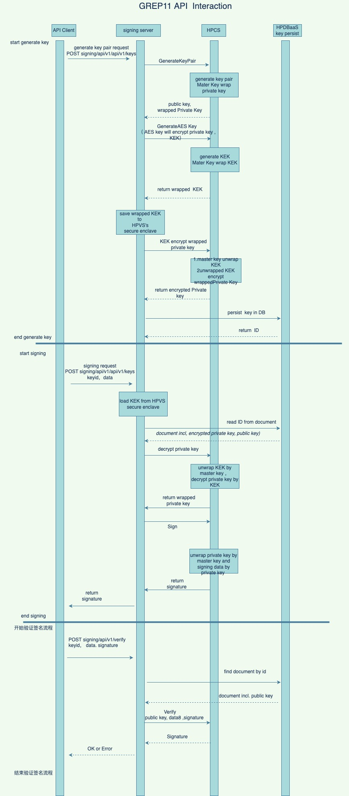
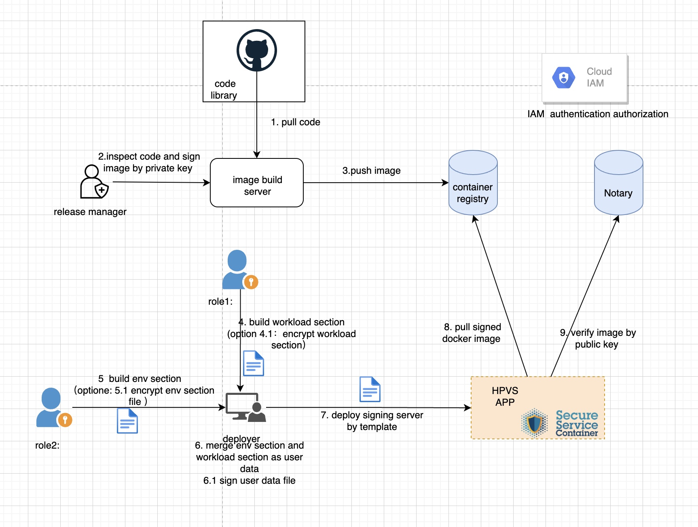

- [1. Signature Server](#1-signature-server)
  - [1.1. Environment introduction](#11-environment-introduction)
  - [1.2. The client communicates with the signature server through the following endpoints](#12-the-client-communicates-with-the-signature-server-through-the-following-endpoints)
  - [1.3. Sequence diagram and description of GREP11 API usage example](#13-sequence-diagram-and-description-of-grep11-api-usage-example)
    - [1.3.1. Step-by-step instructions](#131-step-by-step-instructions)
  - [1.4. Import key process](#14-import-key-process)
    - [1.4.1. GREP11 AP1 import private key sequence diagram and description](#141-grep11-ap1-import-private-key-sequence-diagram-and-description)
    - [1.4.2. Step-by-step instructions](#142-step-by-step-instructions)
- [2. Deploy the signature server](#2-deploy-the-signature-server)
  - [2.1. Introduction to HPVS](#21-introduction-to-hpvs)
    - [2.1.1. Main Features of HPVS](#211-main-features-of-hpvs)
  - [2.2. Main step description and role separation design](#22-main-step-description-and-role-separation-design)
    - [2.2.1. Overview of the main steps](#221-overview-of-the-main-steps)
  - [2.3. Role Definition](#23-role-definition)
  - [2.4. Preparations](#24-preparations)
    - [2.4.1. Installing IBM CLI](#241-installing-ibm-cli)
    - [2.4.2. Install IBM Container Registry](#242-install-ibm-container-registry)
    - [2.4.3. Install Docker](#243-install-docker)
  - [2.5. Building the image](#25-building-the-image)
    - [2.5.1. Clone the repository](#251-clone-the-repository)
    - [2.5.2. Building an Image](#252-building-an-image)
    - [2.5.3. Tag image](#253-tag-image)
  - [2.6. After the version manager inspects the code, execute the signing operation.](#26-after-the-version-manager-inspects-the-code-execute-the-signing-operation)
    - [2.6.1. Create a trust key](#261-create-a-trust-key)
    - [2.6.2. Enable DCT(Docker Content Trust)](#262-enable-dctdocker-content-trust)
    - [2.6.3. Upload image and sign](#263-upload-image-and-sign)
    - [2.6.4. Obtaining the signed public key](#264-obtaining-the-signed-public-key)
  - [2.7. `role 1` Build the WORKLOAD template](#27-role-1-build-the-workload-template)
    - [2.7.1. Convert the compose template file to base64](#271-convert-the-compose-template-file-to-base64)
    - [2.7.2. Building a Workload Template](#272-building-a-workload-template)
    - [2.7.3. Download ibm public key](#273-download-ibm-public-key)
    - [2.7.4. Encrypting workloads](#274-encrypting-workloads)
  - [2.8. `role2`Build an ENV template](#28-role2build-an-env-template)
    - [2.8.1. build env template](#281-build-env-template)
    - [2.8.2. Download ibm public key](#282-download-ibm-public-key)
    - [2.8.3. Encrypted env template](#283-encrypted-env-template)
  - [2.9. Operation and maintenance personnel deploy applications](#29-operation-and-maintenance-personnel-deploy-applications)
    - [2.9.1. buile `user-data.yaml`](#291-buile-user-datayaml)
    - [2.9.2. Creating an instance through the IBM console](#292-creating-an-instance-through-the-ibm-console)
    - [2.9.3. Check the deployment status through logDNA](#293-check-the-deployment-status-through-logdna)
    - [2.9.4. Verifying Application Deployment](#294-verifying-application-deployment)
  - [2.10. Deploying an application via a plaintext template](#210-deploying-an-application-via-a-plaintext-template)
- [3. Sign the transaction using HPCS and broadcast the transaction on the test chain](#3-sign-the-transaction-using-hpcs-and-broadcast-the-transaction-on-the-test-chain)
  - [3.1. Description of main steps](#31-description-of-main-steps)
    - [3.1.1. Generate wallet through HPCS](#311-generate-wallet-through-hpcs)
    - [3.1.2. Apply for test coins](#312-apply-for-test-coins)
    - [3.1.3. Get a target address](#313-get-a-target-address)
    - [3.1.4. Use ethereum-client to broadcast transactions to the test chain rinkeby](#314-use-ethereum-client-to-broadcast-transactions-to-the-test-chain-rinkeby)
    - [3.1.5. Signing transactions on the test chain](#315-signing-transactions-on-the-test-chain)
    - [3.1.6. View transaction results](#316-view-transaction-results)
- [4. Reference Documentation](#4-reference-documentation)

# 1. Signature Server
 
 The signature server shows a scenario of [Hyper Protect Service](https://ibm-hyper-protect.github.io/) 

## 1.1. Environment introduction

- Deploy the signature server to the trusted execution environment HPVS in a manner similar to a multi-party contract
- The client communicates with the signature server through RestAPI (the production environment also requires TLS certificate verification)
- Since the signature server is deployed in HPVS in the form of a black box, the log information is sent to logDNA through the intranet to collect and visualize the log.
- The signing server communicates with HPCS through the GREP11 API (MTLS mutual certificate verification is also required in the production environment)
- Encrypted key, persisted in HPDBaaS
- IAM authenticates access and controls permissions
- VPC's security group and Network ACL control intranet communication on the network
- All communications are within the intranet
- Support IPsec to connect with private network intranet, or expose services through Floating IP+ firewall

## 1.2. The client communicates with the signature server through the following endpoints

```sh

export SIGN_HOST=<ip-address>
export SIGNING_PORT=8080

# Test the connectivity
curl ${SIGN_HOST}:${SIGNING_PORT}/v1/grep11/get_mechanismsc

# Generate an elliptic curve Key pair
curl ${SIGN_HOST}:${SIGNING_PORT}/v1/grep11/key/secp256k1/generate_key_pair -X POST -s | jq

# Get the public key
curl ${SIGN_HOST}:${SIGNING_PORT}/v1/grep11/key/secp256k1/public/${KEY_UUID} -s | jq

# Get a public key in Ethereum format
curl ${SIGN_HOST}:${SIGNING_PORT}/v1/grep11/key/secp256k1/get_ethereum_key/${KEY_UUID}  -s | jq

# After signing on HPCS with p256k1 type signature, use Ethereum type verification signature,
#vVerify the signature method directly call the Ethereum library to execute crypto.VerifySignature
#vEthereum's signature digest must be 32 bits
curl ${SIGN_HOST}:${SIGNING_PORT}/v1/grep11/key/secp256k1/verify_ethereum_pub_key/${KEY_UUID} -X POST  -s -d '{"data":"fad9c8855b740a0b7ed4c221dbad0f33","ethereum_pub_key":"0x0474618a3e3a8a7207c008d9a993b611b2f38f281c53cb8e1e67e5f2c9f0fd8fe572037924791385a203afe1c45149f3918b6df86918a020a822df3d1fc8508b3a"}' | jq

# Get the wrapped private key
curl ${SIGN_HOST}:${SIGNING_PORT}/v1/grep11/key/secp256k1/private/${KEY_UUID} -s | jq

# Sign data with private key
curl ${SIGN_HOST}:${SIGNING_PORT}/v1/grep11/key/secp256k1/sign/${KEY_UUID}  -s -X POST -d '{"data":"the text need to encrypted to verify kay."}' | jq

# Verify signature with public key
curl ${SIGN_HOST}:${SIGNING_PORT}/v1/grep11/key/secp256k1/verify/${KEY_UUID}  -s -X POST -d '{"data":"the text need to encrypted to verify kay.","signature":"Tw/Dk0NUNbklut31DQctitAFeFwkCtdRP7hAcMU84dYRkdXFlCB9mEFzaGpZ+dK/786k7iVQ8a8WRCNF0U7r/Q"}' |jq

# Wrap the imported AES with the master key and persist it to HPDBaaS
curl ${SIGN_HOST}:${SIGNING_PORT}/v1/grep11/key/aes/import -X POST -s -d '{"key_content":"E5E9FA1BA31ECD1AE84F75CAAA474F3A"}' |jq

#Use the encrypted data imported into AESkey to compare the results of plaintext AES encrypted data. If they are the same, it proves that the imported key is correct and is wrapped by the master key.
curl ${SIGN_HOST}:${SIGNING_PORT}/v1/grep11/key/aes/verify/${KEY_UUID}  -X POST -d '{"key_content":"E5E9FA1BA31ECD1AE84F75CAAA474F3A","data":"E5E9FA1BA31ECD1AE84F75CAAA474F3A"}'


####################### 导入外部密钥 (TBD: 需要调试)
# 产生EC 私钥 PEM 格式
openssl ecparam -genkey -name secp256k1 -noout -out secp256k1-key-pair.pem -param_enc explicit

# 提取公钥
openssl ec -in secp256k1-key-pair.pem -pubout > secp256k1-key-pub.pem

# 上传私钥并持久化
curl ${SIGN_HOST}:${SIGNING_PORT}/v1/grep11/key/import_ec -X POST -s  -F "file=@./secp256k1-key-pair.pem" | jq

# 签名ec
curl ${SIGN_HOST}:${SIGNING_PORT}/v1/grep11/key/sign/${KEY_UUID} -s -X POST -d '{"data":"the text need to encrypted to verify kay."}' | jq

# 使用公钥验证签名
curl ${SIGN_HOST}:${SIGNING_PORT}/v1/grep11/key/verify/${KEY_UUID} -s -X POST -d '{"data":"the text need to encrypted to verify kay.","signature":"vW3UVySThT4qQRmocPQiIus8gz1e5+Ch0XHs2YY7LlNN6HWfgWLtYcIjkZdsp0PTYYY73ffF1PnLQ1tTqmyaaQ"}'

#  签名ec 返回ANS1
curl ${SIGN_HOST}:${SIGNING_PORT}/v1/grep11/key/sign/${KEY_UUID}  -s -X POST -d '{"data":"the text need to encrypted to verify kay.","sig_format":"ans1"}' | jq

# 使用本地公钥验证签名
echo -n "the text need to encrypted to verify kay." > test.data
echo -n "MEUCIAgZXWc826mQ9ogdt6lVYiYYHp16rDyutc4Hb8OQdH3CAiEA3OOoTPtz9QW13+RlDTO8DCSOPv4M2Q1HKlf/xXJS6+c" |gbase64 --decode -w 0  > signature.sig
openssl pkeyutl -verify -in test.data -sigfile  signature.sig  -pubin  -inkey ec256-key-pub.pem

```
## 1.3. Sequence diagram and description of GREP11 API usage example


### 1.3.1. Step-by-step instructions


## 1.4. Import key process

###  1.4.1. GREP11 AP1 import private key sequence diagram and description


### 1.4.2. Step-by-step instructions
   - Note: All the private keys generated by HPCS are wrapped by the internal master key and returned. The life cycle of the plaintext key cannot leave the HSM encryption card inside the HPCS. Before the key is used, HPCS will unwrap (decrypt) the wrapped key internally. After the key is used, the plaintext key will be discarded inside the HSM. These steps all take place inside the HPCS, and the client has no Perceived, so this part of the content will not be specifically explained below.
   - The general process is as follows: The imported key needs to be encrypted before being imported, and then decrypted inside the HSM. Inside the HSM, the master key wraps the decrypted plaintext private key, and HPCS returns the wrapped private key to the signature server. The second-encrypted private key is persisted in HPDBaaS.
   - The client request corresponding to the above steps is
     ```sh
      curl ${SIGN_HOST}:${SIGNING_PORT}/v1/grep11/key/import_ec -X POST -s  -F "file=@./ec256-key-pair.pem" | jq
     ```
   - Question 1: After HPCS wraps the private key with the master key, it is equivalent to that the key has been encrypted by the master key. Why is it necessary to use the KEK in the signature server for secondary encryption? This step is optional. The purpose of this step is that the KEK of the signing server is stored in the trusted execution environment within the security boundary of the secure enclave in HPVS, so this ensures that all operations must be performed by the signing server. Initiate because only the signature server has a KEK in it
   - Question 2: How to ensure the security and persistence of the KEK in the signature server? The signature server runs in a trusted execution environment (confidential computing) within HPVS and is deployed through a multi-party contract. The secure enclave in the signature server can be used for snapshots and cross-region backups, and it is encrypted with the seed generated during multi-party deployment, which means that only the client can enter the decryption, because the seed holder is through The form of multi-party deployment is controlled by multiple holders of the client.

# 2. Deploy the signature server

## 2.1. Introduction to HPVS

Based on the [confidential computing architecture](https://www.ibm.com/cloud/learn/confidential-computing), [HPVS for VPC](https://cloud.ibm.com/docs/vpc?topic=vpc-about-se#about_hyperprotect_vs_forvpc) provides a safe, reliable and credible way of deploying applications to computing resources. Compared with traditional CICD and business specification processes, the deployment process provided by IBM can ensure that images and environments cannot be It is tampered with and provides role isolation to ensure that holders of sensitive information or service endpoints cannot access the production environment, and at the same time, it can ensure that deployers cannot access sensitive information.

### 2.1.1. [Main Features of HPVS](https://www.ibm.com/cloud/blog/announcements/ibm-hyper-protect-virtual-servers-for-virtual-private-cloud)

- **Secure Execution**：Ensure that unauthorized users, including IBM Cloud administrators, cannot access applications through technology, not process. Workloads are locked down by separate instance-level security perimeters.
- **Multi-party contracts and proof of deployment**：Apply zero trust principles from workload development to deployment. With multiple roles and legal entities collaborating, segregation of responsibilities and access rights is critical. Hyper Protect Virtual Servers for VPC is based on the concept of cryptographic contracts, enabling each role to provide its own contribution while ensuring that no other role can access this data or IP through encryption. Deployments can be verified by auditors with attestation records, which are signed and encrypted to ensure that only auditors have this insight.
- **Malware Protection**：Use Secure Build to set up a verification process to ensure that only authorized code runs in the application. Hyper Protect Virtual Servers for VPC only deploy container versions, which are verified at deployment time.
- **Bring Your Own OCI Image**：Use any Open Container Initiative (OCI) image and get the benefits of a confidential computing solution for an extra level of protection
- **Flexible Deployment**：Choose from a variety of profile sizes and scale as needed to secure containerized applications and pay by the hour.

## 2.2. Main step description and role separation design


### 2.2.1. Overview of the main steps

- 1 The developer pushes the code, triggers the CICD process, and the version server builds the version image
- 2 The version manager inspects the code, passes the inspection, and signs it with his own private key. Only images signed by the version manager can be deployed
- 3 The signed image is pushed to the mirror repository
- 4 Generate a deployment template through compose, and use the public key to encrypt the deployment template (encryption is an optional step)
- 5 Construct an environment template and use the public key to encrypt the environment variables (encryption is an optional step)
- 6 Merge the template and variables, and use the private key to digest the signature of the template (signature digest is an optional step)
- 7 Operation and maintenance personnel deploy applications through templates
- 8 After the server obtains the template, it decrypts it with the private key, and extracts the public key in the environment variable to perform fingerprint verification on the template.
- 9 The server extracts the public key in the deployment template to verify the image
- After the verification is passed, the application is successfully deployed

(Only the operation and maintenance personnel need to access the production environment, but the authority of the operation and maintenance personnel is the lowest. If the deployment template is encrypted, the operation and maintenance personnel cannot obtain any information.) (The workload template is some deployment image information and some non-sensitive variables. , the env template is usually information about some environment variables)

## 2.3. Role Definition

   角色 | work content | security and isolation
  --|:--|:--
  version manager | View code and version build server logs, sign images. Push the image through the CICD process or manually. If you push the image manually, you need permission to access the image repository | No need to touch production environment 
  role 1 | Build the workload template | No need to touch production environment
  role 2 | Build environment variable template | No need to touch production environment
  Operation and maintenance personnel | The encrypted deployment file is obtained from role 1 and role 2 to deploy the application, but the content of the deployment file cannot be read | No access to sensitive information, only applications can be deployed

## 2.4. Preparations

### 2.4.1. [Installing IBM CLI](https://cloud.ibm.com/docs/cli?topic=cli-getting-started)
### 2.4.2. Install IBM Container Registry
```
ibmcloud plugin repo-plugins -r 'IBM Cloud'  # list all of plugin
ibmcloud plugin install container-registry
```
### 2.4.3. [Install Docker](https://docs.docker.com/engine/install/)
  

## 2.5. Building the image

 The step of building and uploading the image to the IBM container registry is usually triggered automatically by the CICD tool or the build server. We simulate this process manually here.
 
### 2.5.1. Clone the repository
```sh
git clone https://github.com/threen134/signing_server.git
```

### 2.5.2. Building an Image
```sh
# build image 
cd ./signing_server
docker build -t signing_server:v3  .
#If it is a non-s39x architecture, use the following command
docker buildx build --platform=linux/s390x  -t signing_server:v1 .  
```

### 2.5.3. Tag image
```sh
# tag image
# au.icr.io is the endpoint of IBM CR above
# spark-demo is the namespce created above
# s390x-signing-server:v3 is image:tag*
docker tag signing_server:v1 au.icr.io/poc-demo/signing-server:v1
```

## 2.6. After the version manager inspects the code, execute the signing operation.
###  2.6.1. Create a trust key
```sh
# The created key needs to enter the password. When signing the image later, you need to use this key to read the private key for signing
docker trust key generate poc-test-sign-key
```
###  2.6.2. Enable DCT[(Docker Content Trust)](https://docs.docker.com/engine/security/trust/#signing-images-with-docker-content-trust)
```sh
# The syntax format of the DCT environment variable is https://notary.<region>.icr.io, remember to adjust it to your corresponding region
# au in Asia and us in North America notary
export DOCKER_CONTENT_TRUST=1
export DOCKER_CONTENT_TRUST_SERVER=https://notary.au.icr.io
```
### 2.6.3. Upload image and sign
```sh
# Log in to the ibm container registry
ibmcloud login --apikey <your api key> -g Default -r jp-tok
# set region
ibmcloud cr region-set ap-south
ibmcloud cr login 
# Create namespce for IBM CR, the name must be globally unique
ibmcloud cr namespace-add poc-demo
# Upload the image, you need to enter the key of the private key when uploading. If it is the first time to use notary, you also need to set the password of notary
docker push au.icr.io/poc-demo/signing-server:v1
# check signature information
docker trust inspect au.icr.io/poc-demo/signing-server:v1 
```

### 2.6.4. Obtaining the signed public key

To share this public key `role 1`, role 1 needs to add the public key to the build template. When the subsequent image is deployed (step 9 in the topology diagram), this public key is required to verify the signature to ensure the integrity of the image.

```sh
# cat ~/.docker/trust/tuf/au.icr.io/<username>/<imagename>/metadata/root.json
cat ~/.docker/trust/tuf/au.icr.io/poc-demo/signing-server/metadata/root.json  |jq
```
**At this point, the version manager or CICD process has built an image and signed the image with its own private key.**  


## 2.7. `role 1` Build the WORKLOAD template
### 2.7.1. Convert the compose template file to base64

```sh
cd build
tar czvf - -C compose . | base64 -w0
H4sIAOG4/GIAA+3TTW+CMBwGcM77FD3syoui4k....
```
Note: If the execution environment is MAC, please use the gnu version of tar and base64

```sh
brew install coreutils
brew install gnu-tar
alias tar=gtar
alias base64=gbase64
```


### 2.7.2. Building a Workload Template
```yaml
# workload.yaml
type: workload
auths:
  # au.icr.io 为container registry 的endpoint， 
  au.icr.io:
    # 指定用户CR的用户名和密钥，IBM CR的用户名为iamapikey
    password: xxxx
    username: iamapikey
compose:
  # archive 的内容为 1.7.1 把compose模版文件转码为base64的输出
  archive: H4sIAOG4/GIAA+3TTW....
images:
  dct:
      # 如果镜像有被签名，需要指定notary的信息，如果镜像没有被签名，那么compose里的镜像需要指定摘要信息
      # 对应compose里的image信息
    au.icr.io/spark-demo/s390x-signing-server:
      # notary endpoint
      notary: "https://notary.au.icr.io"
      # 步骤1.6.5 中获取到的公钥
      publicKey: LS0tLS1CRUdJTiBDRVJ....
env:
  # 设置一些非敏感环境变量，这些变量对应compose里的信息
  POSTGRESS_ADDRESS: "dbaas905.hyperp-dbaas.cloud.ibm.com"
  POSTGRESS_PORT: "30025"
  POSTGRESS_USERNAME: "admin"
  POSTGRESS_DBNAME: "admin"
  HPCS_ADDRESS: ep11.us-east.hs-crypto.cloud.ibm.com
  HPCS_PORT: "13412"
  HPCS_INSTANCE_ID: "4ad01aec-dc81-4158....."
  HPCS_IAM_ENDPOINT: "https://iam.cloud.ibm.com"
  SECURE_ENCLAVE_PATH: "/etc/secure_enclave"
#数据卷的加密是根据workload里的seed 和 env 字段里的seed 来共同产生的密钥。
#特别注意： boot volume 不可以用来做持久化。重启后boot volume 修改的内容被丢弃
#（boot volume 的任何改动都被视为代码被修改，从而破坏完整性，检测将不会被通过，计算实例将无法部署或者启动）
volumes:
    volume1:
        mount: /etc/secure_enclave
        seed: stsolutiontest
        filesystem: btrfs
```


### 2.7.3. Download ibm public key 
```sh
wget https://cloud.ibm.com/media/docs/downloads/hyper-protect-container-runtime/ibm-hyper-protect-container-runtime-1-0-s390x-3-encrypt.crt
```

### 2.7.4. Encrypting workloads 
```sh
# 设置变量
WORKLOAD=./workload.yaml
CONTRACT_KEY=./ibm-hyper-protect-container-runtime-1-0-s390x-3-encrypt.crt
# 随机产生一个32位密码
PASSWORD="$(openssl rand 32 | base64 -w0)"
# 使用证书加密密码
ENCRYPTED_PASSWORD="$(echo -n "$PASSWORD" | base64 -d | openssl rsautl -encrypt -inkey $CONTRACT_KEY -certin | base64 -w0 )"
#使用密码加密workload
ENCRYPTED_WORKLOAD="$(echo -n "$PASSWORD" | base64 -d | openssl enc -aes-256-cbc -pbkdf2 -pass stdin -in "$WORKLOAD" | base64 -w0)"
#把加密后的密码，与加密后对workload 组合起来
#把得到的输出交给部署人员
echo "hyper-protect-basic.${ENCRYPTED_PASSWORD}.${ENCRYPTED_WORKLOAD}"
#当HPVS第一次构建的时候它会用私钥对密码进行解密，得到明文的密码后，用密码对workload进行解密  
```
如果加密报这个错误 `unknown option '-pbkdf2'`，需要[升级openssh](https://gist.github.com/fernandoaleman/5459173e24d59b45ae2cfc618e20fe06)

备注： 如果执行环境是MAC, 使用openssl 代替默认的 LibreSSL
```
brew update
brew install openssl
# if it is already installed, update it:
brew upgrade openssl@1.1
echo 'export PATH="/opt/homebrew/opt/openssl@3/bin:$PATH"' >> ~/.zshrc
source ~/.zshrc 
```

## 2.8. `role2`Build an ENV template

### 2.8.1. build env template 
这里主要是[设置logDNA的字段](https://cloud.ibm.com/docs/vpc?topic=vpc-about-se&interface=ui#hpcr_setup_logging),可选的数据卷与环境变量

```yaml
# env.yaml
type: env
logging:
  logDNA:
    hostname: syslog-a.private.jp-tok.logging.cloud.ibm.com
    ingestionKey: 7a98add3.....
    port: 6514
volumes:
  volume1:
    seed: thisisatest
env:
  # Set some sensitive environment information
  POSTGRESS_PASSWORD: xxxxx
  # Base64 encoding information of the PG certificate
  # echo ./cert.pem | base64 -w0
  POSTGRESS_SSLROOTCERT: "LS0tLS1CRUdJTiBDRVJUSU....."
  HPCS_IAM_KEY: "xxxx...."
```    

All deployed logs and subsequent application logs can be obtained through logDNA. Please refer to [this document](https://cloud.ibm.com/docs/vpc?topic=vpc-about-se&interface=ui#hpcr_setup_logging) to create and obtain information about LogDNA instances, and logDNA can use [intranet links](https://cloud.ibm.com/docs/log-analysis?topic=log-analysis-service-connection#endpoint-setup)

### 2.8.2. Download ibm public key 
```sh
wget https://cloud.ibm.com/media/docs/downloads/hyper-protect-container-runtime/ibm-hyper-protect-container-runtime-1-0-s390x-3-encrypt.crt
```

### 2.8.3. Encrypted env template
```sh
# 设置变量
ENV=./env.yaml
CONTRACT_KEY=./ibm-hyper-protect-container-runtime-1-0-s390x-3-encrypt.crt
# 随机产生一个32位密码
PASSWORD="$(openssl rand 32 | base64 -w0)"
# 使用证书加密密码
ENCRYPTED_PASSWORD="$(echo -n "$PASSWORD" | base64 -d | openssl rsautl -encrypt -inkey $CONTRACT_KEY -certin | base64 -w0 )"
#使用密码加密workload
ENCRYPTED_ENV="$(echo -n "$PASSWORD" | base64 -d | openssl enc -aes-256-cbc -pbkdf2 -pass stdin -in "$ENV" | base64 -w0)"
#把加密后的密码，与加密后对env 组合起来
#把得到输出交给部署人员
echo "hyper-protect-basic.${ENCRYPTED_PASSWORD}.${ENCRYPTED_ENV}"
#当HPVS第一次构建的时候它会用私钥对密码进行解密，得到明文的密码后，用密码对env进行解密  
```

## 2.9. Operation and maintenance personnel deploy applications

### 2.9.1. buile `user-data.yaml`
从角色1与角色2拿到加密后对数据后构建类似下面的文件
```yaml
  workload: hyper-protect-basic.js7TGt77EQ5bgTIKk5C0pViFTRHqWtn..............
  env: hyper-protect-basic.VWg/5/SWE+9jLfhr8q4i.........
```
### 2.9.2. Creating an instance through the IBM console 
The configuration is as shown below  
  

### 2.9.3. Check the deployment status through logDNA


### 2.9.4. Verifying Application Deployment
Mount a floating IP to the deployed signature server, then list the state machine ·
```sh
curl ${SIGN_HOST}:${SIGNING_PORT}/v1/grep11/get_mechanismsc
```

## 2.10. Deploying an application via a plaintext template
If you do not need encrypted deployment, you can also deploy the application through the clear text template, which is usually used in the development environment or when testing the deployment.

```yaml
# cat user-data.yaml
workload: |
  type: workload
  auths:
    au.icr.io:
      password: Do0JROuGXO....
      username: iamapikey
  compose:
    archive: H4sIAOG4/GIAA+3TTW....
  images:
    dct:
      au.icr.io/spark-demo/s390x-signing-server:
        notary: "https://notary.au.icr.io"
        publicKey: LS0tLS1CRUdJTiBDRVJUSUZ.....
  env:
    POSTGRESS_ADDRESS: dbaas905.hyperp-dbaas.c....
    POSTGRESS_PORT: "30025"
    POSTGRESS_USERNAME: "admin"
    POSTGRESS_DBNAME: "admin"
    HPCS_ADDRESS: ep11.us-east.hs-crypto.cloud.ibm.com
    HPCS_PORT: "13412"
    HPCS_INSTANCE_ID: ad01aec-dc81.....
    HPCS_IAM_ENDPOINT: "https://iam.cloud.ibm.com"
    SECURE_ENCLAVE_PATH: "/etc/secure_enclave"
  volumes:
    volume1:
      mount: /etc/secure_enclave
      seed: stsolutiontest
      filesystem: btrfs
env: |
  type: env
  logging:
    logDNA:
      hostname: syslog-a.private.jp-tok.logging.cloud.ibm.com
      ingestionKey: 7a98add39999e9.....
      port: 6514
  volumes:
    volume1:
      seed: thisisatest
  env:
    POSTGRESS_PASSWORD: "......"
    POSTGRESS_SSLROOTCERT: "LS0tLS1CRUdJTiBDRVJUSUZJQ0FURS0t....."
    HPCS_IAM_KEY: "3lHSZqcuCh4b_....
```

# 3. Sign the transaction using HPCS and broadcast the transaction on the test chain
## 3.1. Description of main steps
### 3.1.1. Generate wallet through HPCS
```sh

export SIGN_HOST=localhost
export SIGNING_PORT=8080
curl ${SIGN_HOST}:${SIGNING_PORT}/v1/grep11/key/secp256k1/generate_key_pair -X POST -s | jq
# 获取钱吧的UUID并设置到环境变量
export KEY_UUID=c006f05e-002c-4fcf-b530-6e9820db03db
#获取 from_address 交易地址
curl ${SIGN_HOST}:${SIGNING_PORT}/v1/grep11/key/secp256k1/get_ethereum_key/${KEY_UUID}  -s | jq
```

### 3.1.2. Apply for test coins
Get the address generated in the previous step and apply for test coins on the [fauceth](https://fauceth.komputing.org/) rinkeby

### 3.1.3. Get a target address
Get a target transaction address, or generate a new wallet through the above steps and get `to address`

### 3.1.4. Use ethereum-client to broadcast transactions to the test chain rinkeby
- Loading environment variables
```sh
cd ./ethereum-client
cp ./env.sh.template ./env.sh
# full parameter to env.sh and load env
source ./ethereum-client/env.sh
```

### 3.1.5. Signing transactions on the test chain
```sh 
  go run ./... 
  # output
  https://rinkeby.etherscan.io/tx/0x71231d85bfa7497f09a54023535874779a3e73a2c0084fa8a1612f9cb709a7a1 
```

### 3.1.6. View transaction results


# 4. Reference Documentation
- [About the contract](https://cloud.ibm.com/docs/vpc?topic=vpc-about-contract_se#hpcr_contract_encrypt_workload)
- [signing-images-with-docker-content-trust](https://docs.docker.com/engine/security/trust/#signing-images-with-docker-content-trust) 
- [How to Sign Your Docker Images](https://www.cloudsavvyit.com/12388/how-to-sign-your-docker-images-to-increase-trust)
- [Docker Notary服务架构](https://blog.csdn.net/weixin_41335923/article/details/121702125)

