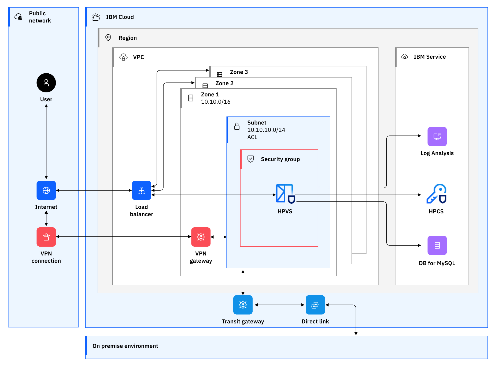
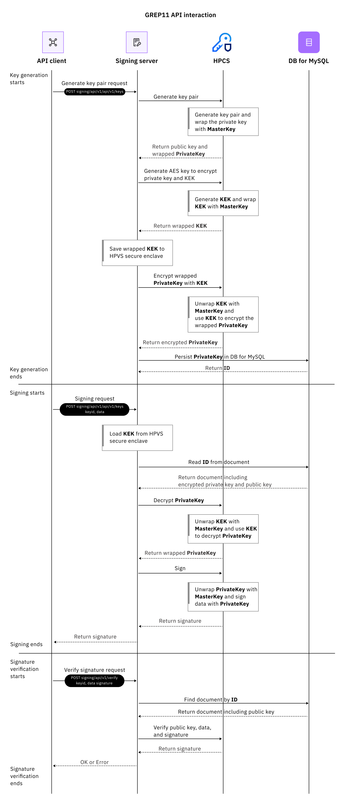

# Signing transactions with the signature server

The signature server shows a scenario of using [Hyper Protect Service](https://developer.ibm.com/components/hyper-protect/), including IBM Cloud Hyper Protect Virtual Server for VPC (HPVS) and IBM Cloud Hyper Protect Crypto Services (HPCS).

- [Signing transactions with the signature server](#signing-transactions-with-the-signature-server)
  - [1. Signature server overview](#1-signature-server-overview)
    - [1.1. Environment introduction](#11-environment-introduction)
    - [1.2. Client communication endpoints](#12-client-communication-endpoints)
    - [1.3. GREP11 API usage example](#13-grep11-api-usage-example)
    - [1.4. Importing the key](#14-importing-the-key)
      - [1.4.1. Frequently asked questions](#141-frequently-asked-questions)
  - [2. Deploying the signature server](#2-deploying-the-signature-server)
    - [2.1. Introduction to HPVS](#21-introduction-to-hpvs)
      - [2.1.1. Key features of HPVS](#211-key-features-of-hpvs)
    - [2.2. Main steps description and role separation design](#22-main-steps-description-and-role-separation-design)
    - [2.3. Role definition](#23-role-definition)
    - [2.4. Prerequisites](#24-prerequisites)
    - [2.5. Building the image](#25-building-the-image)
    - [2.6. Signing the image](#26-signing-the-image)
    - [2.7. Building the workload template](#27-building-the-workload-template)
    - [2.8. Build an enviroment template](#28-build-an-enviroment-template)
    - [2.9. Deploying applications](#29-deploying-applications)
    - [2.10. Deploying an application with a plaintext template](#210-deploying-an-application-with-a-plaintext-template)
  - [3. Signing the transaction with HPCS and broadcasting the transaction on the test chain](#3-signing-the-transaction-with-hpcs-and-broadcasting-the-transaction-on-the-test-chain)
  - [4. Reference documentation](#4-reference-documentation)


## 1. Signature server overview
 
The signature server is built with Hyper Protect Services in IBM Cloud to sign your transactions in a hyper secure environment.

### 1.1. Environment introduction

*Figure 1. Signature server architecture diagram*

The signature server environment contains the following components and fuctions:
- The signature server is deployed to the trusted execution environment of HPVS in a manner that is similar to a multi-party contract.
- The client communicates with the signature server through RestAPI. Note that for a production environment, TLS certificate verification is also required.
- Because the signature server is deployed in HPVS in the form of a black box, the log information is sent to logDNA through the intranet to collect and visualize the logs.
- The signing server communicates with HPCS through the GREP11 API. Note that for a production environment, MTLS mutual certificate verification is also required.
- Encrypted key is persisted in to DB.
- IAM authenticates access and control permissions.
- The VPC's security group and Network ACL control intranet communication on the network.
- All communications are within the intranet.
- Support IPsec to connect with private network intranet, or expose services through Floating IP and firewall.

### 1.2. Client communication endpoints

```sh

export SIGN_HOST=<ip-address>
export SIGNING_PORT=8080

# Test the connectivity
curl ${SIGN_HOST}:${SIGNING_PORT}/v1/grep11/get_mechanismsc

# Generate an elliptic curve key pair
curl ${SIGN_HOST}:${SIGNING_PORT}/v1/grep11/key/secp256k1/generate_key_pair -X POST -s | jq

# Get the public key
curl ${SIGN_HOST}:${SIGNING_PORT}/v1/grep11/key/secp256k1/public/${KEY_UUID} -s | jq

# Get a public key in Ethereum format
curl ${SIGN_HOST}:${SIGNING_PORT}/v1/grep11/key/secp256k1/get_ethereum_key/${KEY_UUID}  -s | jq

# After signing on HPCS with p256k1 type signature, use Ethereum type verification signature,
# To verify the signature method, call the Ethereum library to execute `crypto.VerifySignature`.
# The Ethereum's signature digest must be 32 bits.
curl ${SIGN_HOST}:${SIGNING_PORT}/v1/grep11/key/secp256k1/verify_ethereum_pub_key/${KEY_UUID} -X POST  -s -d '{"data":"fad9c8855b740a0b7ed4c221dbad0f33","ethereum_pub_key":"0x0474618a3e3a8a7207c008d9a993b611b2f38f281c53cb8e1e67e5f2c9f0fd8fe572037924791385a203afe1c45149f3918b6df86918a020a822df3d1fc8508b3a"}' | jq

# Get the wrapped private key
curl ${SIGN_HOST}:${SIGNING_PORT}/v1/grep11/key/secp256k1/private/${KEY_UUID} -s | jq

# Sign data with private key
curl ${SIGN_HOST}:${SIGNING_PORT}/v1/grep11/key/secp256k1/sign/${KEY_UUID}  -s -X POST -d '{"data":"the text need to encrypted to verify kay."}' | jq

# Verify signature with public key
curl ${SIGN_HOST}:${SIGNING_PORT}/v1/grep11/key/secp256k1/verify/${KEY_UUID}  -s -X POST -d '{"data":"the text need to encrypted to verify kay.","signature":"Tw/Dk0NUNbklut31DQctitAFeFwkCtdRP7hAcMU84dYRkdXFlCB9mEFzaGpZ+dK/786k7iVQ8a8WRCNF0U7r/Q"}' |jq

# Wrap the imported AES with the master key and persist it to DB
curl ${SIGN_HOST}:${SIGNING_PORT}/v1/grep11/key/aes/import -X POST -s -d '{"key_content":"E5E9FA1BA31ECD1AE84F75CAAA474F3A"}' |jq

# Use the encrypted data that is imported into AESkey to compare the results of plaintext AES encrypted data. If they are the same, it proves that the imported key is correct and wrapped by the master key.
curl ${SIGN_HOST}:${SIGNING_PORT}/v1/grep11/key/aes/verify/${KEY_UUID}  -X POST -d '{"key_content":"E5E9FA1BA31ECD1AE84F75CAAA474F3A","data":"E5E9FA1BA31ECD1AE84F75CAAA474F3A"}'


####################### Import external keys (TBD: customization and debugging required)
# Generate EC private key in the form of PEM
openssl ecparam -genkey -name secp256k1 -noout -out secp256k1-key-pair.pem -param_enc explicit

# Extract the public key
openssl ec -in secp256k1-key-pair.pem -pubout > secp256k1-key-pub.pem

# Upload the private kay and persist it in to DB
curl ${SIGN_HOST}:${SIGNING_PORT}/v1/grep11/key/import_ec -X POST -s  -F "file=@./secp256k1-key-pair.pem" | jq

# Sign EC
curl ${SIGN_HOST}:${SIGNING_PORT}/v1/grep11/key/sign/${KEY_UUID} -s -X POST -d '{"data":"the text need to encrypted to verify kay."}' | jq

# Verify signature with the public key
curl ${SIGN_HOST}:${SIGNING_PORT}/v1/grep11/key/verify/${KEY_UUID} -s -X POST -d '{"data":"the text need to encrypted to verify kay.","signature":"vW3UVySThT4qQRmocPQiIus8gz1e5+Ch0XHs2YY7LlNN6HWfgWLtYcIjkZdsp0PTYYY73ffF1PnLQ1tTqmyaaQ"}'

# Sign EC and reture ANS1
curl ${SIGN_HOST}:${SIGNING_PORT}/v1/grep11/key/sign/${KEY_UUID}  -s -X POST -d '{"data":"the text need to encrypted to verify kay.","sig_format":"ans1"}' | jq

# Verify signature with local public key
echo -n "the text need to encrypted to verify kay." > test.data
echo -n "MEUCIAgZXWc826mQ9ogdt6lVYiYYHp16rDyutc4Hb8OQdH3CAiEA3OOoTPtz9QW13+RlDTO8DCSOPv4M2Q1HKlf/xXJS6+c" |gbase64 --decode -w 0  > signature.sig
openssl pkeyutl -verify -in test.data -sigfile  signature.sig  -pubin  -inkey ec256-key-pub.pem

```

### 1.3. GREP11 API usage example

Figure 2 shows the sequence of GREP11 API interaction process.

 
*Figure 2. GREP11 API interaction sequence diagram*


### 1.4. Importing the key

Figure 3 shows the sequence of importing private key.


*Figure 3. GREP11 API import private key sequence diagram*

**Note:** All the private keys generated by HPCS are wrapped by the internal master key and then returned. The lifecycle of the plaintext key cannot leave the HSM encryption card inside the HPCS. Before the key is used, HPCS will unwrap (decrypt) the wrapped key internally. After the key is used, the plaintext key will be discarded inside the HSM. These steps all take place inside the HPCS, and the client has no Perceived, so this part of the content will not be specifically explained below.

The general process is:
1. The imported key needs to be encrypted before being imported, and then decrypted inside the HSM. 
2. Inside the HSM, the master key wraps the decrypted plaintext private key, and HPCS returns the wrapped private key to the signature server. 
3. The second-encrypted private key is persisted in DB.

The client request corresponding to the above steps is
  ```sh
    curl ${SIGN_HOST}:${SIGNING_PORT}/v1/grep11/key/import_ec -X POST -s  -F "file=@./ec256-key-pair.pem" | jq
  ```
  
#### 1.4.1. Frequently asked questions
**Q1:** After HPCS wraps the private key with the master key, it is equivalent to that the key has been encrypted by the master key. Why is it necessary to use the KEK in the signature server for secondary encryption? 

**A:** This step is optional. The purpose of this step is that the KEK of the signing server is stored in the trusted execution environment within the security boundary of the secure enclave in HPVS, and this ensures that all operations must be performed by the signing server. Initiately, it is because only the signature server has a KEK in it.

**Q2:** How to ensure the security and persistence of the KEK in the signature server?

**A:** The signature server runs in a trusted execution environment (confidential computing) within HPVS and is deployed through a multi-party contract. The secure enclave in the signature server can be used for snapshots and cross-region backups, and it is encrypted with the seed that is generated during multi-party deployment. Therefore, only the client can enter the decryption because the seed holder is through the form of multi-party deployment that is controlled by multiple holders of the client.

## 2. Deploying the signature server
This section guides you step by step to deploy the signature server.

### 2.1. Introduction to HPVS

Based on the [confidential computing architecture](https://www.ibm.com/cloud/learn/confidential-computing), [HPVS for VPC](https://cloud.ibm.com/docs/vpc?topic=vpc-about-se#about_hyperprotect_vs_forvpc) provides a safe, reliable, and credible way of deploying applications to computing resources. Compared with the traditional CICD and business specification processes, the deployment process provided by IBM ensures that images and environments cannot be tampered. It provides role isolation to ensure that sensitive information holders or service endpoints cannot access the production environment; while at the mean time, to ensure that deployers cannot access any sensitive information.

#### 2.1.1. Key features of HPVS

[HPVS for PVC](https://www.ibm.com/cloud/blog/announcements/ibm-hyper-protect-virtual-servers-for-virtual-private-cloud) provides the following key functions: 

- **Secure execution**: Ensure that unauthorized users, including IBM Cloud administrators, cannot access applications technologyly, not operationally. Workloads are locked down by separate instance-level security boundary.
- **Multi-party contracts and proof of deployment**: While applying Zero Trust principles from workload development to deployment, multiple roles and legal entities will collaborate together. Therefore, it's critical to segregate responsibilities and access authorities. HPVS for VPC is based on the concept of cryptographic contracts, which enables each role to provide its own contribution while ensuring that no other roles can access the encrypted data or IP. Deployments can be verified by auditors with attestation records, which are signed and encrypted to ensure that only auditors can do so.
- **Malware protection**: Use Secure Build to set up a verification process to ensure that only authorized code runs in the application. HPVS for VPC deploy only container versions that are verified at deployment time.
- **Bring your own OCI image**: Use any Open Container Initiative (OCI) image and get the benefits of a confidential computing solution for an extra level of protection.
- **Flexible deployment**: Choose from a variety of profile sizes and scale as needed to secure containerized applications and pay by hours.

### 2.2. Main steps description and role separation design

*Figure 4. Signature server deployment steps*

Main steps explanation:
1. The developer pushes the code, triggers the CICD process, and builds the version image.
2. The version manager inspects the code, passes the inspection, and signs it with his own private key. Note that only images that the version manager signs can be deployed.
3. The signed image is pushed to the mirror repository.
4. Compose and generate a deployment template, and use the public key to encrypt the deployment template. Encryption is an optional step.
5. Create an environment template and use the public key to encrypt the environment variables. Encryption is an optional step.
6.  Merge the deploy template and evironment variables, and use the private key to sign the template. Signature is an optional step.
7. The operator deploys applications with the template.
8. After the server obtains the template, it decrypts the template with the private key, and then extracts the public key in the environment variable to perform fingerprint verification.
9. The server extracts the public key in the deployment template to verify the image. After the verification is passed, the application is successfully deployed.

**Notes:**
- Only the operator needs to access the production environment, but the authority of the operator is the lowest. If the deployment template is encrypted, the operator cannot obtain any information. 
- The workload template contains some deployment image information and some non-sensitive variables. The environment template usually contains some information about environment variables.

### 2.3. Role definition

 Role | Resopnsibility | Security and isolation
--|:--|:--
Version manager | View code and version, build server logs, sign images, and push the image through the CICD process or manually. If you push the image manually, you need the authority to access the image repository. | No need to access production environment. 
Role 1 | Build the workload template. | No need to access production environment.
Role 2 | Build environment variable template. | No need to access production environment.
Operator | Obtain the encrypted deployment file from Role 1 and Role 2 to deploy the application. However, cannot read the information inside the deployment file. | Only be able to deploy the application. No access to any sensitive information.

### 2.4. Prerequisites
Complete the following prerequisites before build and deploy the image.

1. Install [IBM CLI](https://cloud.ibm.com/docs/cli?topic=cli-getting-started).
2. Install IBM Container Registry.
  ```
  ibmcloud plugin repo-plugins -r 'IBM Cloud'  # list all of plugin
  ibmcloud plugin install container-registry
  ```
3. Install [Docker](https://docs.docker.com/engine/install/).
  

### 2.5. Building the image

The step of building and uploading the image to the IBM container registry is usually triggered automatically by the CICD tool or the build server. This section introduces the manual process.
 
1. Clone the repository.
  ```sh
  git clone https://github.com/IBM/full-temperature-wallet-solution.git
  ```

2. Build an image.
  ```sh
  # build image 
  cd ./signing_server
  docker build -t signing_server:v3  .
  #If it is a non-s39x architecture, use the following command
  docker buildx build --platform=linux/s390x  -t signing_server:v1 .  
  ```

3. Tag the image.
  ```sh
  # tag image
  # au.icr.io is the endpoint of IBM CR above
  # spark-demo is the namespce created above
  # s390x-signing-server:v3 is image:tag*
  docker tag signing_server:v1 au.icr.io/poc-demo/signing-server:v1
  ```

### 2.6. Signing the image
After inspecting the code, the version manager signs the image.

1. Create a trust key.
  ```sh
  # The created key needs to enter the password. When signing the image later, you need to use this key to read the private key for signing
  docker trust key generate poc-test-sign-key
  ```

2. Enable Docker Content Trust.
  ```sh
  # The syntax format of the DCT environment variable is https://notary.<region>.icr.io, remember to adjust it to your corresponding region
  # au in Asia and us in North America notary
  export DOCKER_CONTENT_TRUST=1
  export DOCKER_CONTENT_TRUST_SERVER=https://notary.au.icr.io
  ```
  For more information about Docker Content Trust, see [(Docker Content Trust)](https://docs.docker.com/engine/security/trust/#signing-images-with-docker-content-trust).

3. Sign and upload the image.
  ```sh
  # Log in to the ibm container registry
  ibmcloud login --apikey <your api key> -g Default -r jp-tok
  # set region
  ibmcloud cr region-set ap-south
  ibmcloud cr login 
  # Create namespce for IBM CR, the name must be globally unique
  ibmcloud cr namespace-add poc-demo
  # Upload the image, you need to enter the key of the private key when uploading. If it is the first time to use notary, you also need to set the password of notary
  docker push au.icr.io/poc-demo/signing-server:v1
  # check signature information
  docker trust inspect au.icr.io/poc-demo/signing-server:v1 
  ```

4. Obtain the signed public key
  To share the public key `role 1`, Role 1 needs to add the public key to the build template. When the subsequent image is deployed (see Step 9 in Figure 3. Main steps), this public key is required to verify the signature to ensure the integrity of the image.

  ```sh
  # cat ~/.docker/trust/tuf/au.icr.io/<username>/<imagename>/metadata/root.json
  cat ~/.docker/trust/tuf/au.icr.io/poc-demo/signing-server/metadata/root.json  |jq
  ```
  
  At this point, the version manager or CICD process has built and signed an image with his own private key.


### 2.7. Building the workload template
Role 1 is responsible to build the workload template.

1. Convert the compose template file to `base64`.
  ```sh
  cd build
  tar czvf - -C compose . | base64 -w0
  H4sIAOG4/GIAA+3TTW+CMBwGcM77FD3syoui4k....
  ```
  
  **Note:** If the execution environment is MAC, use the `gnu` version of `tar` and `base64`.
  ```sh
  brew install coreutils
  brew install gnu-tar
  alias tar=gtar
  alias base64=gbase64
  ```

2. Build a workload template.
  ```yaml
  # workload.yaml
  type: workload
  auths:
    # au.icr.io is the endpoint of container registry
    au.icr.io:
      # Specify the user name and password for user CR. The user name of IBM CR is `iamapikey`.
      password: xxxx
      username: iamapikey
  compose:
    # The archived information is the base64 output converted from the compose template in step 1.
    archive: H4sIAOG4/GIAA+3TTW....
  images:
    dct:
        # If the image is signed, the notary information is required. 
        # If the image is not signed, specify abstract information matching the image information in the compose template
      au.icr.io/spark-demo/s390x-signing-server:
        # Notary endpoint
        notary: "https://notary.au.icr.io"
        # The public key retrieved in step 4
        publicKey: LS0tLS1CRUdJTiBDRVJ....
  env:
    # Configure some non-sensitive env variables, which should match information in the compose template
    DB_ADDRESS: "dbaas905.hyperp-dbaas.cloud.ibm.com"
    DB_PORT: "30025"
    DB_USERNAME: "admin"
    DB_DBNAME: "admin"
    HPCS_ADDRESS: ep11.us-east.hs-crypto.cloud.ibm.com
    HPCS_PORT: "13412"
    HPCS_INSTANCE_ID: "4ad01aec-dc81-4158....."
    HPCS_IAM_ENDPOINT: "https://iam.cloud.ibm.com"
    SECURE_ENCLAVE_PATH: "/etc/secure_enclave"
  # Volume encryption is completed with both `seed` in workload template and `seed` in env.
  # Special note, boot volume cannot be used for persistence。The changes in boot volume will be lost after reboot.
  # Any changes in boot volume are considered as code change and integrity break.
  # This will cause failure in code inspection, and thus applications cannot be deployed or rebooted.
  volumes:
      volume1:
          mount: /etc/secure_enclave
          seed: stsolutiontest
          filesystem: btrfs
  ```
  
3. Download IBM public key 
  ```sh
  wget https://cloud.ibm.com/media/docs/downloads/hyper-protect-container-runtime/ibm-hyper-protect-container-runtime-1-0-s390x-3-encrypt.crt
  ```

4. Encrypt workloads.
  ```sh
  # Configure variables
  WORKLOAD=./workload.yaml
  CONTRACT_KEY=./ibm-hyper-protect-container-runtime-1-0-s390x-3-encrypt.crt
  # Generate a 32-bit password randomly
  PASSWORD="$(openssl rand 32 | base64 -w0)"
  # Encrypt the password with certificate 
  ENCRYPTED_PASSWORD="$(echo -n "$PASSWORD" | base64 -d | openssl rsautl -encrypt -inkey $CONTRACT_KEY -certin | base64 -w0 )"
  # Encrypt workloads with pasword
  ENCRYPTED_WORKLOAD="$(echo -n "$PASSWORD" | base64 -d | openssl enc -aes-256-cbc -pbkdf2 -pass stdin -in "$WORKLOAD" | base64 -w0)"
  # Compose the encrypted password and workload
  # Handover the composed output to the operator for application deployment
  echo "hyper-protect-basic.${ENCRYPTED_PASSWORD}.${ENCRYPTED_WORKLOAD}"
  # When you use HPVS for the first time, it will decrypt the password with the private key. 
  # After HPVS gets the plaintext password, it uses the password to decrypt the workload.
  ```
  
  If you get an error of `unknown option '-pbkdf2'`, you need to [upgrade the `openssh`](https://gist.github.com/fernandoaleman/5459173e24d59b45ae2cfc618e20fe06).

  **Note:** If the execution environment is MAC, use `openssl` to istead of the default `LibreSSL`.
  
  ```
  brew update
  brew install openssl
  # if it is already installed, update it:
  brew upgrade openssl@1.1
  echo 'export PATH="/opt/homebrew/opt/openssl@3/bin:$PATH"' >> ~/.zshrc
  source ~/.zshrc 
  ```

### 2.8. Build an enviroment template
Role 2 is responsible to build the environment template.

1. Create an environment template.
  The major requirement is to [configure logDNA](https://cloud.ibm.com/docs/vpc?topic=vpc-about-se&interface=ui#hpcr_setup_logging) about data volumes to choose and environment variables.

  ```yaml
  # env.yaml
  type: env
  logging:
    logDNA:
      hostname: syslog-a.private.jp-tok.logging.cloud.ibm.com
      ingestionKey: 7a98add3.....
      port: 6514
  volumes:
    volume1:
      seed: thisisatest
  env:
    # Set some sensitive environment information
    DB_PASSWORD: xxxxx
    # Base64 encoding information of the PG certificate
    # cat ./cert.pem | base64 -w0
    DB_SSLROOTCERT: "LS0tLS1CRUdJTiBDRVJUSU....."
    HPCS_IAM_KEY: "xxxx...."
  ```    

  All deployed logs and subsequent application logs can be obtained through logDNA. For more information about creating a logging instance and obtaining information from it, see [Logging for HPVS for VPC](https://cloud.ibm.com/docs/vpc?topic=vpc-logging-for-hyper-protect-virtual-servers-for-vpc). The logging instance can use [intranet links](https://cloud.ibm.com/docs/log-analysis?topic=log-analysis-service-connection#endpoint-setup).

2. Download IBM public key.
  ```sh
  wget https://cloud.ibm.com/media/docs/downloads/hyper-protect-container-runtime/ibm-hyper-protect-container-runtime-1-0-s390x-3-encrypt.crt
  ```

3. Encrypt the environment template.
  ```sh
  # Configure variables
  ENV=./env.yaml
  CONTRACT_KEY=./ibm-hyper-protect-container-runtime-1-0-s390x-3-encrypt.crt
  # Generate a 32-bit password randomly
  PASSWORD="$(openssl rand 32 | base64 -w0)"
  # Encrypt the password with certificate 
  ENCRYPTED_PASSWORD="$(echo -n "$PASSWORD" | base64 -d | openssl rsautl -encrypt -inkey $CONTRACT_KEY -certin | base64 -w0 )"
  # Encrypt workloads with pasword
  ENCRYPTED_ENV="$(echo -n "$PASSWORD" | base64 -d | openssl enc -aes-256-cbc -pbkdf2 -pass stdin -in "$ENV" | base64 -w0)"
  # Compose the encrypted password and workload
  # Handover the composed output to the operator for application deployment
  echo "hyper-protect-basic.${ENCRYPTED_PASSWORD}.${ENCRYPTED_ENV}"
  # When you use HPVS for the first time, it will decrypt the password with the private key. 
  # After HPVS gets the plaintext password, it uses the password to decrypt the workload.
  ```

### 2.9. Deploying applications
The operator is responsible to deploy the applications.

1. Build `user-data.yaml`. After you get encrypted workload template and environment template, create the user data file that is similar to the following one:
  ```yaml
    workload: hyper-protect-basic.js7TGt77EQ5bgTIKk5C0pViFTRHqWtn..............
    env: hyper-protect-basic.VWg/5/SWE+9jLfhr8q4i.........
  ```

2. Create an instance in the IBM console. Refer to the configuration in the following example. 
   
  *Figure 5. Create an HPVS for VPC instance*  

3. Check the deployment status with logDNA.
   
  *Figure 6. Logging example*

4. Verify the application deployment. Mount a floating IP to the deployed signature server, then list the state machine.
  ```sh
  curl ${SIGN_HOST}:${SIGNING_PORT}/v1/grep11/get_mechanismsc
  ```

### 2.10. Deploying an application with a plaintext template
If you do not need encrypted deployment, you can deploy the application through the plaintext template, which is usually used in the development environment or for deployment tests.

```yaml
# cat user-data.yaml
workload: |
  type: workload
  auths:
    au.icr.io:
      password: Do0JROuGXO....
      username: iamapikey
  compose:
    archive: H4sIAOG4/GIAA+3TTW....
  images:
    dct:
      au.icr.io/spark-demo/s390x-signing-server:
        notary: "https://notary.au.icr.io"
        publicKey: LS0tLS1CRUdJTiBDRVJUSUZ.....
  env:
    DB_ADDRESS: dbaas905.hyperp-dbaas.c....
    DB_PORT: "30025"
    DB_USERNAME: "admin"
    DB_DBNAME: "admin"
    HPCS_ADDRESS: ep11.us-east.hs-crypto.cloud.ibm.com
    HPCS_PORT: "13412"
    HPCS_INSTANCE_ID: ad01aec-dc81.....
    HPCS_IAM_ENDPOINT: "https://iam.cloud.ibm.com"
    SECURE_ENCLAVE_PATH: "/etc/secure_enclave"
  volumes:
    volume1:
      mount: /etc/secure_enclave
      seed: stsolutiontest
      filesystem: btrfs
env: |
  type: env
  logging:
    logDNA:
      hostname: syslog-a.private.jp-tok.logging.cloud.ibm.com
      ingestionKey: 7a98add39999e9.....
      port: 6514
  volumes:
    volume1:
      seed: thisisatest
  env:
    DB_PASSWORD: "......"
    DB_SSLROOTCERT: "LS0tLS1CRUdJTiBDRVJUSUZJQ0FURS0t....."
    HPCS_IAM_KEY: "3lHSZqcuCh4b_....
```

## 3. Signing the transaction with HPCS and broadcasting the transaction on the test chain

1. Generate a wallet with HPCS.
  ```sh
  export SIGN_HOST=localhost
  export SIGNING_PORT=8080
  curl ${SIGN_HOST}:${SIGNING_PORT}/v1/grep11/key/secp256k1/generate_key_pair -X POST -s | jq
  # Export the UUID of the wallet and configure it as an env variable
  export KEY_UUID=c006f05e-002c-4fcf-b530-6e9820db03db
  # Retrieve the `from address` of the transaction
  curl ${SIGN_HOST}:${SIGNING_PORT}/v1/grep11/key/secp256k1/get_ethereum_key/${KEY_UUID}  -s | jq
  ```

2. Apply for test coins. Get the address that is generated in step 1 and apply for test coins on the [fauceth](https://fauceth.komputing.org/) `rinkeby`.

3. Get a target transaction address, or generate a new wallet with the above steps and get the `to address`.

4. Use `ethereum-client` to broadcast transactions to the test chain `rinkeby`. 
  Load environment variables.
  ```sh
  cd ./ethereum-client
  cp ./env.sh.template ./env.sh
  # full parameter to env.sh and load env
  source ./ethereum-client/env.sh
  ```

5. Sign transactions on the test chain.
  ```sh 
    go run ./... 
    # output
    https://rinkeby.etherscan.io/tx/0x71231d85bfa7497f09a54023535874779a3e73a2c0084fa8a1612f9cb709a7a1 
  ```

6. View transaction results
  
  
  *Figure 7. Transaction results example*

## 4. Reference documentation
- [About the contract](https://cloud.ibm.com/docs/vpc?topic=vpc-about-contract_se#hpcr_contract_encrypt_workload)
- [signing-images-with-docker-content-trust](https://docs.docker.com/engine/security/trust/#signing-images-with-docker-content-trust) 
- [How to Sign Your Docker Images](https://www.cloudsavvyit.com/12388/how-to-sign-your-docker-images-to-increase-trust)
- [Docker Notary服务架构](https://blog.csdn.net/weixin_41335923/article/details/121702125)
