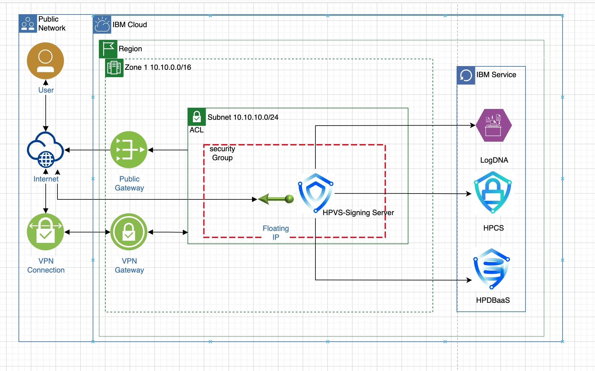
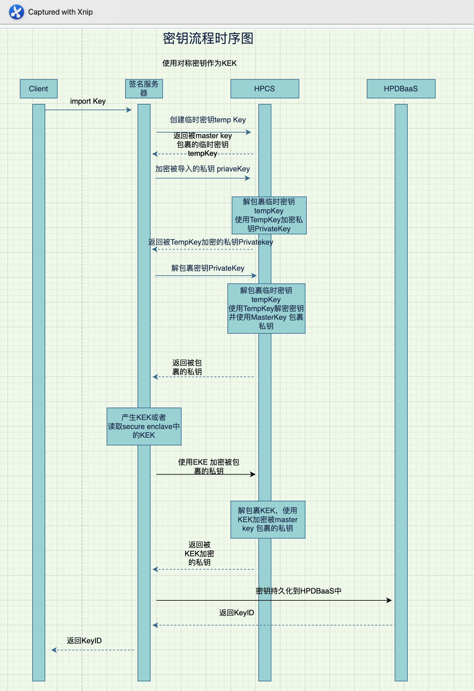
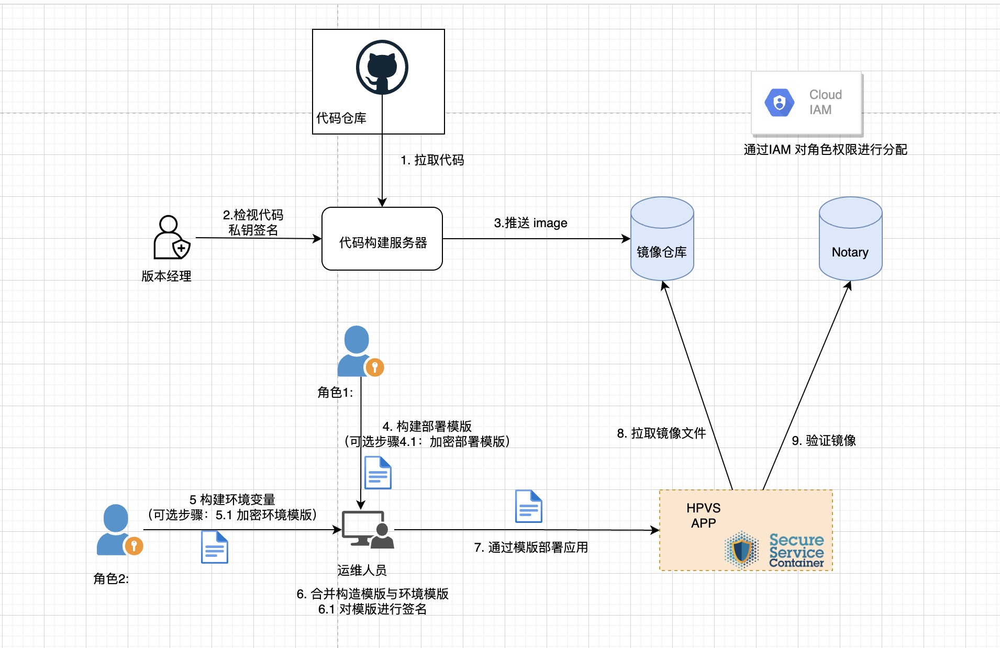
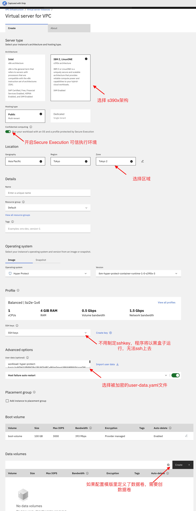
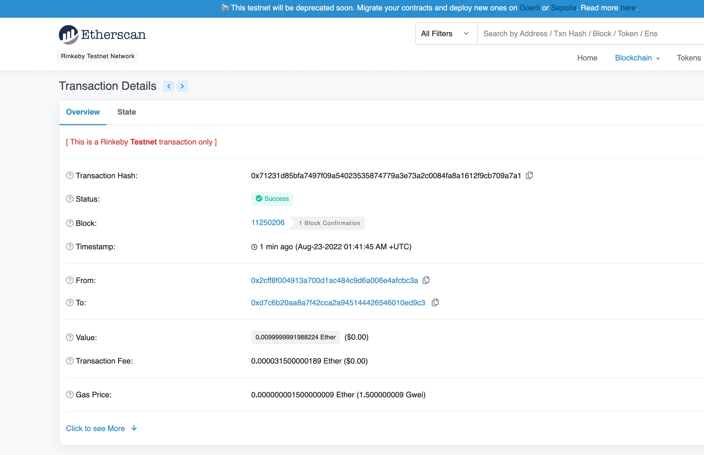

- [1. 签名服务器](#1-签名服务器)
  - [1.1. 环境介绍](#11-环境介绍)
  - [1.2. Client 通过下列endpoint 与签名服务器通信](#12-client-通过下列endpoint-与签名服务器通信)
  - [1.3. GREP11 API 使用举例时序图与说明](#13-grep11-api-使用举例时序图与说明)
    - [1.3.1. 步骤说明](#131-步骤说明)
  - [1.4. 导入密钥流程](#14-导入密钥流程)
    - [1.4.1. GREP11 AP1 导入私钥时序图与说明](#141-grep11-ap1-导入私钥时序图与说明)
    - [1.4.2. 步骤说明](#142-步骤说明)
- [2. 部署签名服务器](#2-部署签名服务器)
  - [2.1. HPVS 介绍](#21-hpvs-介绍)
    - [2.1.1. HPVS 的主要特性](#211-hpvs-的主要特性)
  - [2.2. 主要步骤描述与角色分离设计](#22-主要步骤描述与角色分离设计)
    - [2.2.1. 主要步骤概述](#221-主要步骤概述)
  - [2.3. 角色定义](#23-角色定义)
  - [2.4. 准备工作](#24-准备工作)
    - [2.4.1. 安装IBMCLI](#241-安装ibmcli)
    - [2.4.2. 安装IBM Container Registry](#242-安装ibm-container-registry)
    - [2.4.3. 安装Docker](#243-安装docker)
  - [2.5. 构建镜像](#25-构建镜像)
    - [2.5.1. 克隆代码仓库](#251-克隆代码仓库)
    - [2.5.2. 构建镜像](#252-构建镜像)
    - [2.5.3. tag镜像](#253-tag镜像)
  - [2.6. 版本经理检视代码后，执行签名操作。](#26-版本经理检视代码后执行签名操作)
    - [2.6.1. 创建trust key](#261-创建trust-key)
    - [2.6.2. 开启DCT(Docker Content Trust)](#262-开启dctdocker-content-trust)
    - [2.6.3. 上传镜像并签名](#263-上传镜像并签名)
    - [2.6.4. 获取签名的公钥](#264-获取签名的公钥)
  - [2.7. `角色1`构建WORKLOAD模版](#27-角色1构建workload模版)
    - [2.7.1. 把compose模版文件转码为base64](#271-把compose模版文件转码为base64)
    - [2.7.2. 构建workload模版](#272-构建workload模版)
    - [2.7.3. 下载ibm的公钥](#273-下载ibm的公钥)
    - [2.7.4. 加密workload](#274-加密workload)
  - [2.8. `角色2`构建ENV模版](#28-角色2构建env模版)
    - [2.8.1. 创建env 模版](#281-创建env-模版)
    - [2.8.2. 下载ibm的公钥](#282-下载ibm的公钥)
    - [2.8.3. 加密env 模版](#283-加密env-模版)
  - [2.9. 运维人员部署应用](#29-运维人员部署应用)
    - [2.9.1. 构建`user-data.yaml`文件](#291-构建user-datayaml文件)
    - [2.9.2. 通过IBM console 创建实例](#292-通过ibm-console-创建实例)
    - [2.9.3. 通过logDNA 查看部署情况](#293-通过logdna-查看部署情况)
    - [2.9.4. 验证应用部署](#294-验证应用部署)
  - [2.10. 通过明文模版部署应用](#210-通过明文模版部署应用)
- [3. 使用HPCS签名交易，并上测试链广播交易](#3-使用hpcs签名交易并上测试链广播交易)
  - [3.1. 主要步骤说明](#31-主要步骤说明)
    - [3.1.1. 通过HPCS 产生 钱包](#311-通过hpcs-产生-钱包)
    - [3.1.2. 申请测试币](#312-申请测试币)
    - [3.1.3. 获取一个目标地址](#313-获取一个目标地址)
    - [3.1.4. 使用 ethereum-client 广播交易到 测试链 rinkeby](#314-使用-ethereum-client-广播交易到-测试链-rinkeby)
    - [3.1.5. 在测试链上签名交易](#315-在测试链上签名交易)
    - [3.1.6. 查看交易结果](#316-查看交易结果)
- [4. 参考文档](#4-参考文档)

# 1. 签名服务器
 
 签名服务器展示[Hyper Protect Service](https://ibm-hyper-protect.github.io/) 的使用场景

## 1.1. 环境介绍

- 通过类似多方合约的方式部署签名服务器到可信执行环境HPVS 
- Client 通过RestAPI与签名服务器通信 （生产环境还需要TLS证书验证）
- 由于签名服务器是以黑盒子的方式部署到HPVS内的，这里log信息通过内网发送到logDNA对log进行收集与可视化检索。
- 签名服务器通过GREP11 API 与HPCS 通信 (生产环境还需要有MTLS 双向证书验证)
- 经过加密的密钥，持久化到HPDBaaS内 
- IAM 对访问做认证以及权限控制
- VPC 的security group 和Network ACL 对网络做内网通信控制 
- 所有通信都在内网内
- 支持IPsec 与 专线的内网打通，或者通过Floating IP+ firewall的方式对外暴露服务


## 1.2. Client 通过下列endpoint 与签名服务器通信

```sh

export SIGN_HOST=<ip-address>
export SIGNING_PORT=8080

# 测试连通性
curl ${SIGN_HOST}:${SIGNING_PORT}/v1/grep11/get_mechanismsc

# 产生椭圆曲线Key pair
curl ${SIGN_HOST}:${SIGNING_PORT}/v1/grep11/key/secp256k1/generate_key_pair -X POST -s | jq

# 获取公钥
curl ${SIGN_HOST}:${SIGNING_PORT}/v1/grep11/key/secp256k1/public/${KEY_UUID} -s | jq

# 获取ethereum 格式的公钥
curl ${SIGN_HOST}:${SIGNING_PORT}/v1/grep11/key/secp256k1/get_ethereum_key/${KEY_UUID}  -s | jq

# 使用secp256k1类型的私钥在HPCS 上签名，签名后使用ethereum类型的公钥验证签名，
# 验证签名方法直接调用以太坊的库执行  crypto.VerifySignature
# 以太坊的签名摘要必须是32位
curl ${SIGN_HOST}:${SIGNING_PORT}/v1/grep11/key/secp256k1/verify_ethereum_pub_key/${KEY_UUID} -X POST  -s -d '{"data":"fad9c8855b740a0b7ed4c221dbad0f33","ethereum_pub_key":"0x0474618a3e3a8a7207c008d9a993b611b2f38f281c53cb8e1e67e5f2c9f0fd8fe572037924791385a203afe1c45149f3918b6df86918a020a822df3d1fc8508b3a"}' | jq

·# 获取被包裹的私钥
curl ${SIGN_HOST}:${SIGNING_PORT}/v1/grep11/key/secp256k1/private/${KEY_UUID} -s | jq

# 使用私钥签名数据
curl ${SIGN_HOST}:${SIGNING_PORT}/v1/grep11/key/secp256k1/sign/${KEY_UUID}  -s -X POST -d '{"data":"the text need to encrypted to verify kay."}' | jq

# 使用公钥验证签名
curl ${SIGN_HOST}:${SIGNING_PORT}/v1/grep11/key/secp256k1/verify/${KEY_UUID}  -s -X POST -d '{"data":"the text need to encrypted to verify kay.","signature":"Tw/Dk0NUNbklut31DQctitAFeFwkCtdRP7hAcMU84dYRkdXFlCB9mEFzaGpZ+dK/786k7iVQ8a8WRCNF0U7r/Q"}' |jq

# 使用master key包裹导入的AES，并持久化到HPDBaaS
curl ${SIGN_HOST}:${SIGNING_PORT}/v1/grep11/key/aes/import -X POST -s -d '{"key_content":"E5E9FA1BA31ECD1AE84F75CAAA474F3A"}' |jq

#使用导入到AESkey 加密数据与明文AES加密数据结果对比，如果一样就证明导入到key是正确的，并且被master key 包裹了
curl ${SIGN_HOST}:${SIGNING_PORT}/v1/grep11/key/aes/verify/${KEY_UUID}  -X POST -d '{"key_content":"E5E9FA1BA31ECD1AE84F75CAAA474F3A","data":"E5E9FA1BA31ECD1AE84F75CAAA474F3A"}'


####################### 导入外部密钥 (TBD: 需要调试)
# 产生EC 私钥 PEM 格式
openssl ecparam -genkey -name secp256k1 -noout -out secp256k1-key-pair.pem -param_enc explicit

# 提取公钥
openssl ec -in secp256k1-key-pair.pem -pubout > secp256k1-key-pub.pem

# 上传私钥并持久化
curl ${SIGN_HOST}:${SIGNING_PORT}/v1/grep11/key/import_ec -X POST -s  -F "file=@./secp256k1-key-pair.pem" | jq

# 签名ec
curl ${SIGN_HOST}:${SIGNING_PORT}/v1/grep11/key/sign/${KEY_UUID} -s -X POST -d '{"data":"the text need to encrypted to verify kay."}' | jq

# 使用公钥验证签名
curl ${SIGN_HOST}:${SIGNING_PORT}/v1/grep11/key/verify/${KEY_UUID} -s -X POST -d '{"data":"the text need to encrypted to verify kay.","signature":"vW3UVySThT4qQRmocPQiIus8gz1e5+Ch0XHs2YY7LlNN6HWfgWLtYcIjkZdsp0PTYYY73ffF1PnLQ1tTqmyaaQ"}'

#  签名ec 返回ANS1
curl ${SIGN_HOST}:${SIGNING_PORT}/v1/grep11/key/sign/${KEY_UUID}  -s -X POST -d '{"data":"the text need to encrypted to verify kay.","sig_format":"ans1"}' | jq

# 使用本地公钥验证签名
echo -n "the text need to encrypted to verify kay." > test.data
echo -n "MEUCIAgZXWc826mQ9ogdt6lVYiYYHp16rDyutc4Hb8OQdH3CAiEA3OOoTPtz9QW13+RlDTO8DCSOPv4M2Q1HKlf/xXJS6+c" |gbase64 --decode -w 0  > signature.sig
openssl pkeyutl -verify -in test.data -sigfile  signature.sig  -pubin  -inkey ec256-key-pub.pem

```
## 1.3. GREP11 API 使用举例时序图与说明


### 1.3.1. 步骤说明


## 1.4. 导入密钥流程

###  1.4.1. GREP11 AP1 导入私钥时序图与说明


### 1.4.2. 步骤说明
   - 说明： 所有HPCS产生的私钥都通过内部的master key进行包裹后返回的，明文密钥的生命周期不能离开HPCS内部的HSM加密卡。在密钥使用前，HPCS会对被包裹的密钥在内部进行解包裹（解密），密钥使用后，明文密钥在HSM内部被丢弃，这些步骤都是发生在HPCS内部的，客户是无感知的，所以下面不对这部分内容做特别说明。

   - 大致流程如下：
   导入的密钥需要在导入之前对密钥进行加密，然后在HSM内部进行解密。在HSM 内部，master key对解密后的明文私钥进行包裹，HPCS返回被包裹的私钥给签名服务器，签名服务器用本地的KEK在HPCS内对被包裹的私钥进行二次加密，被KEK二次加密的私钥，持久化到HPDBaaS内。

   - 以上步骤对应的客户端请求为
     ```sh
      curl ${SIGN_HOST}:${SIGNING_PORT}/v1/grep11/key/import_ec -X POST -s  -F "file=@./ec256-key-pair.pem" | jq
     ```
   
   - 疑问1：HPCS 对私钥使用master key 包裹后，相当于密钥已经被master key加密了，为什么还需要用签名服务器内的KEK进行二次加密？
   这一步是可选的，设计这一步的目的是签名服务器的KEK是保存在HPVS内的secure enclave内的安全边界内的可信执行环境里的，所以这可以保证所有的操作必须由签名服务器来发起，因为只有签名服务器内有KEK


   - 疑问2： 如何保证签名服务器内对KEK的安全与可持久性？
    签名服务器本事运行在HPVS内的可信执行环境里（机密计算）并且通过多方合约的方式部署上去的。 签名服务器内的secure enclave 是可以做快照与跨区域备份的，而且是用多方部署的时候的产生的种子进行加密的，这意味着只有客户自己才能进场解密，因为种子的持有人是通过多方部署的形式由客户多个持有人控制的。


# 2. 部署签名服务器

## 2.1. HPVS 介绍
[HPVS for VPC](https://cloud.ibm.com/docs/vpc?topic=vpc-about-se#about_hyperprotect_vs_forvpc) 基于[机密计算](https://www.ibm.com/cloud/learn/confidential-computing)的体系结构下，提供了一种安全可靠可信的部署应用到计算资源的方式，和传统的CICD与业务规范流程相比，IBM提供的部署流程能保证镜像与环境无法被篡改，同时提供了角色隔离，保证敏感信息的持有者或者服务端点无法接触到生产环境，同时可以保证部署人员无法接触到敏感信息。

### 2.1.1. [HPVS 的主要特性](https://www.ibm.com/cloud/blog/announcements/ibm-hyper-protect-virtual-servers-for-virtual-private-cloud)

- **安全执行**：通过技术而不是流程保证未经授权的用户（包括 IBM Cloud 管理员）无法访问应用程序。工作负载被单独的实例级安全边界锁定。
- **多方合同和部署证明**：从工作负载开发到部署应用零信任原则。随着多个角色和法人实体的协作，区分职责和访问权限至关重要。适用于 VPC 的 Hyper Protect Virtual Servers 基于加密合同概念，使每个角色都能够提供自己的贡献，同时通过加密确保其他角色都无法访问此数据或IP。部署可以由审计人员通过证明记录进行验证，该记录经过签名和加密，以确保只有审计人员具有这种洞察力。
- **恶意软件保护**：利用 Secure Build 设置验证过程，以确保只有授权代码在应用程序中运行。Hyper Protect Virtual Servers for VPC 仅部署容器版本，这些版本在部署时进行验证。
- **自带 OCI 映像**：使用任何开放容器倡议 (OCI) 映像并获得机密计算解决方案的好处，以提供额外级别的保护
- **灵活的部署**：从各种配置文件大小中进行选择，并根据需要进行扩展，以保护容器化应用程序并按小时付费。

## 2.2. 主要步骤描述与角色分离设计


### 2.2.1. 主要步骤概述
  
- 1 开发人员push 代码，触发CICD流程，版本服务器构建版本镜像
- 2 版本经理检视代码，检视通过，使用自己的私钥进行签名，只有经过版本经理签名的镜像才能够被部署
- 3 签名后的镜像被推送到镜像仓库
- 4 通过compose 生成部署模版，使用公钥对部署模版加密（加密为可选步骤）
- 5 构造环境模版，使用公钥对环境变量进行加密（加密为可选步骤）
- 6 合并模版与变量，使用私钥对模版进行摘要签名 （签名摘要为可选步骤）
- 7 运维人员通过模版部署应用
- 8 服务器获取到模版后，使用私钥进行解密，并提取环境变量里的公钥对模版进行指纹验证。
- 9 服务器提取部署模版里的公钥对镜像进行验证
- 验证通过后，应用成功部署

（只有运维人员需要接触生产环境，但是运维人员的权限是最低的，如果部署模版经过加密，那么运维人员获取不到任何信息。）
（workload模版为一些部署镜像信息以及一些非敏感变量，env模版通常为一些环境变量的信息）
## 2.3. 角色定义

   角色 | 工作内容 | 安全与隔离性
  --|:--|:--
  版本经理 | 检视代码与版本构建服务器的日志，签名镜像。通过CICD流程或者手动推送镜像，如果手动推送镜像，需要访问镜像仓库的权限 | 不需要接触生产环境 
  角色1 | 构建workload模版 | 不需要接触生产环境
  角色2 | 构建环境变量模版 | 不需要接触生产环境
  运维人员 | 从角色1和角色2拿到被加密的部署文件部署应用，但是无法读取部署文件的内容 | 不能接触敏感信息，只能部署应用

## 2.4. 准备工作

### 2.4.1. [安装IBMCLI](https://cloud.ibm.com/docs/cli?topic=cli-getting-started)
### 2.4.2. 安装IBM Container Registry
```
ibmcloud plugin repo-plugins -r 'IBM Cloud'  # list all of plugin
ibmcloud plugin install container-registry
```
### 2.4.3. [安装Docker](https://docs.docker.com/engine/install/)
  

## 2.5. 构建镜像

 构建并上传镜像到IBM container registry  
 这一步通常由CICD工具或者构建服务器自动触发，我们这里手动模拟这个流程。
 
### 2.5.1. 克隆代码仓库
```sh
git clone https://github.com/threen134/signing_server.git
```

### 2.5.2. 构建镜像
```sh
# 创建镜像
cd ./signing_server
docker build -t signing_server:v3  .
# 如果是非s39x架构， 使用下面对命令
docker buildx build --platform=linux/s390x  -t signing_server:v1 .  
```

### 2.5.3. tag镜像
```sh
# tag 镜像
# au.icr.io 为上文中 IBM CR的endpoint 
# spark-demo 为上文创建的namespce
# s390x-signing-server:v3 为image：tag*  
docker tag signing_server:v1 au.icr.io/poc-demo/signing-server:v1
```

## 2.6. 版本经理检视代码后，执行签名操作。
###  2.6.1. 创建trust key
```sh
# 创建的密钥需要输入密码，后面签名镜像的时候需要使用这个密钥读取私钥进行签名
docker trust key generate poc-test-sign-key
```
###  2.6.2. 开启DCT[(Docker Content Trust)](https://docs.docker.com/engine/security/trust/#signing-images-with-docker-content-trust)
```sh
# DCT 环境变量的语法格式为https://notary.<region>.icr.io， 记得调整为自己对应的region
# 亚洲地区有au，北美区域有us支持 notary
export DOCKER_CONTENT_TRUST=1
export DOCKER_CONTENT_TRUST_SERVER=https://notary.au.icr.io
```
### 2.6.3. 上传镜像并签名
```sh
# 登陆ibm container registry 
ibmcloud login --apikey <your api key> -g Default -r jp-tok
# 设置区域
ibmcloud cr region-set ap-south
ibmcloud cr login 
#为IBM CR 创建namespce，名字必须全局唯一
ibmcloud cr namespace-add poc-demo
# 上载镜像， 上传的时候需要输入私钥的密钥，如果是第一次使用notary，还需要设置notary的密码
docker push au.icr.io/poc-demo/signing-server:v1
# 查看签名信息
docker trust inspect au.icr.io/poc-demo/signing-server:v1 
```

### 2.6.4. 获取签名的公钥
 把这个公钥分享给`角色1`, 角色1需要把公钥加入到构建模版，后续镜像被部署的时候(拓扑图步骤9)，需要这个公钥验证签名来保证镜像的完整性。
```sh
# cat ~/.docker/trust/tuf/au.icr.io/<username>/<imagename>/metadata/root.json
cat ~/.docker/trust/tuf/au.icr.io/poc-demo/signing-server/metadata/root.json  |jq
```
**至此，版本经理或者CICD流程，构建了一个image，并且使用自己的私钥签名了这个image。**  


## 2.7. `角色1`构建WORKLOAD模版
### 2.7.1. 把compose模版文件转码为base64

```sh
cd build
tar czvf - -C compose . | base64 -w0
H4sIAOG4/GIAA+3TTW+CMBwGcM77FD3syoui4k....
```
备注：
如果执行环境是MAC， 请使用 gnu版本的 tar 与 base64 
```sh
brew install coreutils
brew install gnu-tar
alias tar=gtar
alias base64=gbase64
```


### 2.7.2. 构建workload模版
```yaml
# workload.yaml
type: workload
auths:
  # au.icr.io 为container registry 的endpoint， 
  au.icr.io:
    # 指定用户CR的用户名和密钥，IBM CR的用户名为iamapikey
    password: xxxx
    username: iamapikey
compose:
  # archive 的内容为 1.7.1 把compose模版文件转码为base64的输出
  archive: H4sIAOG4/GIAA+3TTW....
images:
  dct:
      # 如果镜像有被签名，需要指定notary的信息，如果镜像没有被签名，那么compose里的镜像需要指定摘要信息
      # 对应compose里的image信息
    au.icr.io/spark-demo/s390x-signing-server:
      # notary endpoint
      notary: "https://notary.au.icr.io"
      # 步骤1.6.5 中获取到的公钥
      publicKey: LS0tLS1CRUdJTiBDRVJ....
env:
  # 设置一些非敏感环境变量，这些变量对应compose里的信息
  POSTGRESS_ADDRESS: "dbaas905.hyperp-dbaas.cloud.ibm.com"
  POSTGRESS_PORT: "30025"
  POSTGRESS_USERNAME: "admin"
  POSTGRESS_DBNAME: "admin"
  HPCS_ADDRESS: ep11.us-east.hs-crypto.cloud.ibm.com
  HPCS_PORT: "13412"
  HPCS_INSTANCE_ID: "4ad01aec-dc81-4158....."
  HPCS_IAM_ENDPOINT: "https://iam.cloud.ibm.com"
  SECURE_ENCLAVE_PATH: "/etc/secure_enclave"
#数据卷的加密是根据workload里的seed 和 env 字段里的seed 来共同产生的密钥。
#特别注意： boot volume 不可以用来做持久化。重启后boot volume 修改的内容被丢弃
#（boot volume 的任何改动都被视为代码被修改，从而破坏完整性，检测将不会被通过，计算实例将无法部署或者启动）
volumes:
    volume1:
        mount: /etc/secure_enclave
        seed: stsolutiontest
        filesystem: btrfs
```


### 2.7.3. 下载ibm的公钥 
```sh
wget https://cloud.ibm.com/media/docs/downloads/hyper-protect-container-runtime/ibm-hyper-protect-container-runtime-1-0-s390x-3-encrypt.crt
```

### 2.7.4. 加密workload 
```sh
# 设置变量
WORKLOAD=./workload.yaml
CONTRACT_KEY=./ibm-hyper-protect-container-runtime-1-0-s390x-3-encrypt.crt
# 随机产生一个32位密码
PASSWORD="$(openssl rand 32 | base64 -w0)"
# 使用证书加密密码
ENCRYPTED_PASSWORD="$(echo -n "$PASSWORD" | base64 -d | openssl rsautl -encrypt -inkey $CONTRACT_KEY -certin | base64 -w0 )"
#使用密码加密workload
ENCRYPTED_WORKLOAD="$(echo -n "$PASSWORD" | base64 -d | openssl enc -aes-256-cbc -pbkdf2 -pass stdin -in "$WORKLOAD" | base64 -w0)"
#把加密后的密码，与加密后对workload 组合起来
#把得到的输出交给部署人员
echo "hyper-protect-basic.${ENCRYPTED_PASSWORD}.${ENCRYPTED_WORKLOAD}"
#当HPVS第一次构建的时候它会用私钥对密码进行解密，得到明文的密码后，用密码对workload进行解密  
```
如果加密报这个错误 `unknown option '-pbkdf2'`，需要[升级openssh](https://gist.github.com/fernandoaleman/5459173e24d59b45ae2cfc618e20fe06)

备注： 如果执行环境是MAC, 使用openssl 代替默认的 LibreSSL
```
brew update
brew install openssl
# if it is already installed, update it:
brew upgrade openssl@1.1
echo 'export PATH="/opt/homebrew/opt/openssl@3/bin:$PATH"' >> ~/.zshrc
source ~/.zshrc 
```

## 2.8. `角色2`构建ENV模版

### 2.8.1. 创建env 模版
这里主要是[设置logDNA的字段](https://cloud.ibm.com/docs/vpc?topic=vpc-about-se&interface=ui#hpcr_setup_logging),可选的数据卷与环境变量

```yaml
# env.yaml
type: env
logging:
  logDNA:
    hostname: syslog-a.private.jp-tok.logging.cloud.ibm.com
    ingestionKey: 7a98add3.....
    port: 6514
volumes:
  volume1:
    seed: thisisatest
env:
  # 设置一些敏感环境信息
  POSTGRESS_PASSWORD: xxxxx
  # PG 的证书base64 编码信息
  # echo ./cert.pem | base64 -w0
  POSTGRESS_SSLROOTCERT: "LS0tLS1CRUdJTiBDRVJUSU....."
  HPCS_IAM_KEY: "xxxx...."
```

部署的所有日志和后续应用程序的日志，可以通过logDNA来获取日志，请[参考这个文档](https://cloud.ibm.com/docs/vpc?topic=vpc-about-se&interface=ui#hpcr_setup_logging)创建并获取LogDNA实例的信息，同时logDNA可以使用[内网链接](https://cloud.ibm.com/docs/log-analysis?topic=log-analysis-service-connection#endpoint-setup)    

### 2.8.2. 下载ibm的公钥 
```sh
wget https://cloud.ibm.com/media/docs/downloads/hyper-protect-container-runtime/ibm-hyper-protect-container-runtime-1-0-s390x-3-encrypt.crt
```

### 2.8.3. 加密env 模版
```sh
# 设置变量
ENV=./env.yaml
CONTRACT_KEY=./ibm-hyper-protect-container-runtime-1-0-s390x-3-encrypt.crt
# 随机产生一个32位密码
PASSWORD="$(openssl rand 32 | base64 -w0)"
# 使用证书加密密码
ENCRYPTED_PASSWORD="$(echo -n "$PASSWORD" | base64 -d | openssl rsautl -encrypt -inkey $CONTRACT_KEY -certin | base64 -w0 )"
#使用密码加密workload
ENCRYPTED_ENV="$(echo -n "$PASSWORD" | base64 -d | openssl enc -aes-256-cbc -pbkdf2 -pass stdin -in "$ENV" | base64 -w0)"
#把加密后的密码，与加密后对env 组合起来
#把得到输出交给部署人员
echo "hyper-protect-basic.${ENCRYPTED_PASSWORD}.${ENCRYPTED_ENV}"
#当HPVS第一次构建的时候它会用私钥对密码进行解密，得到明文的密码后，用密码对env进行解密  
```

## 2.9. 运维人员部署应用

### 2.9.1. 构建`user-data.yaml`文件
从角色1与角色2拿到加密后对数据后构建类似下面的文件
```yaml
  workload: hyper-protect-basic.js7TGt77EQ5bgTIKk5C0pViFTRHqWtn..............
  env: hyper-protect-basic.VWg/5/SWE+9jLfhr8q4i.........
```
### 2.9.2. 通过IBM console 创建实例 
配置如下图  
  

### 2.9.3. 通过logDNA 查看部署情况


### 2.9.4. 验证应用部署
挂载一个floating IP 到部署的签名服务器, 然后list 状态机·
```sh
curl ${SIGN_HOST}:${SIGNING_PORT}/v1/grep11/get_mechanismsc
```

## 2.10. 通过明文模版部署应用
 如果你没有加密部署的需求，也可以通过明文模版的方式部署应用，这通常用于开发环境或者对部署进行测试时使用。
```yaml
# cat user-data.yaml
workload: |
  type: workload
  auths:
    au.icr.io:
      password: Do0JROuGXO....
      username: iamapikey
  compose:
    archive: H4sIAOG4/GIAA+3TTW....
  images:
    dct:
      au.icr.io/spark-demo/s390x-signing-server:
        notary: "https://notary.au.icr.io"
        publicKey: LS0tLS1CRUdJTiBDRVJUSUZ.....
  env:
    POSTGRESS_ADDRESS: dbaas905.hyperp-dbaas.c....
    POSTGRESS_PORT: "30025"
    POSTGRESS_USERNAME: "admin"
    POSTGRESS_DBNAME: "admin"
    HPCS_ADDRESS: ep11.us-east.hs-crypto.cloud.ibm.com
    HPCS_PORT: "13412"
    HPCS_INSTANCE_ID: ad01aec-dc81.....
    HPCS_IAM_ENDPOINT: "https://iam.cloud.ibm.com"
    SECURE_ENCLAVE_PATH: "/etc/secure_enclave"
  volumes:
    volume1:
      mount: /etc/secure_enclave
      seed: stsolutiontest
      filesystem: btrfs
env: |
  type: env
  logging:
    logDNA:
      hostname: syslog-a.private.jp-tok.logging.cloud.ibm.com
      ingestionKey: 7a98add39999e9.....
      port: 6514
  volumes:
    volume1:
      seed: thisisatest
  env:
    POSTGRESS_PASSWORD: "......"
    POSTGRESS_SSLROOTCERT: "LS0tLS1CRUdJTiBDRVJUSUZJQ0FURS0t....."
    HPCS_IAM_KEY: "3lHSZqcuCh4b_....
```

# 3. 使用HPCS签名交易，并上测试链广播交易
## 3.1. 主要步骤说明
### 3.1.1. 通过HPCS 产生 钱包
```sh

export SIGN_HOST=localhost
export SIGNING_PORT=8080
curl ${SIGN_HOST}:${SIGNING_PORT}/v1/grep11/key/secp256k1/generate_key_pair -X POST -s | jq
# 获取钱吧的UUID并设置到环境变量
export KEY_UUID=c006f05e-002c-4fcf-b530-6e9820db03db
#获取 from_address 交易地址
curl ${SIGN_HOST}:${SIGNING_PORT}/v1/grep11/key/secp256k1/get_ethereum_key/${KEY_UUID}  -s | jq
```

### 3.1.2. 申请测试币
拿到上一步产生的地址，在[水管](https://fauceth.komputing.org/)上申请`rinkeby`测试币
### 3.1.3. 获取一个目标地址
获取一个目标交易地址, 或者通过上面的步骤生产一个新的钱包并获取 `to address`
### 3.1.4. 使用 ethereum-client 广播交易到 测试链 rinkeby
- 加载环境变量
```sh
cd ./ethereum-client
cp ./env.sh.template ./env.sh
# 编辑env.sh
source ./ethereum-client/env.sh
```

### 3.1.5. 在测试链上签名交易
```sh 
  go run ./... 
  # 得到输出
  https://rinkeby.etherscan.io/tx/0x71231d85bfa7497f09a54023535874779a3e73a2c0084fa8a1612f9cb709a7a1 
```

### 3.1.6. 查看交易结果



# 4. 参考文档
- [About the contract](https://cloud.ibm.com/docs/vpc?topic=vpc-about-contract_se#hpcr_contract_encrypt_workload)
- [signing-images-with-docker-content-trust](https://docs.docker.com/engine/security/trust/#signing-images-with-docker-content-trust) 
- [How to Sign Your Docker Images](https://www.cloudsavvyit.com/12388/how-to-sign-your-docker-images-to-increase-trust)
- [Docker Notary服务架构](https://blog.csdn.net/weixin_41335923/article/details/121702125)

