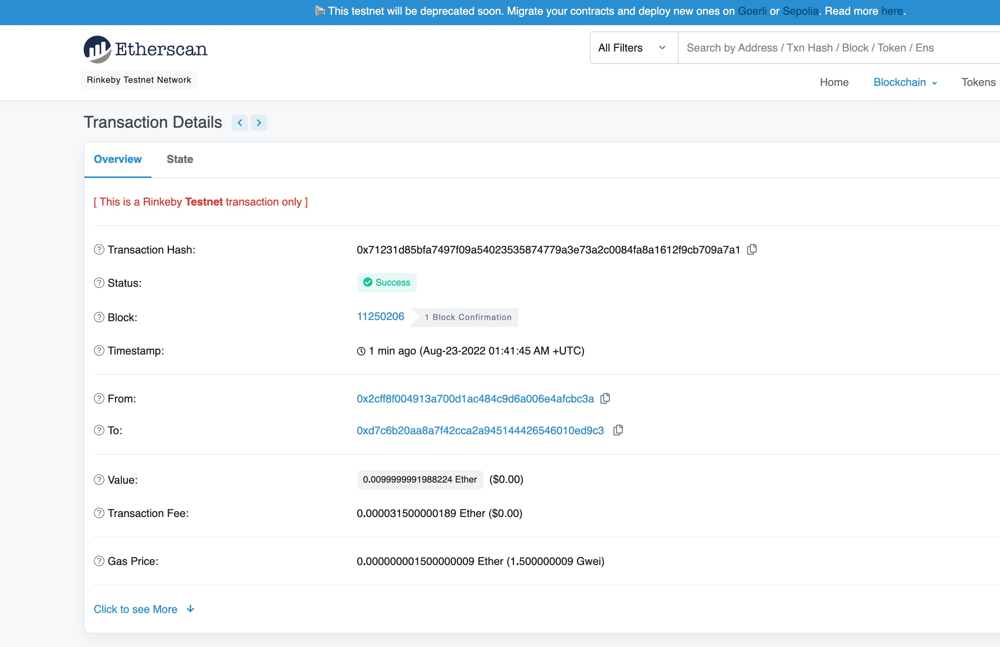

# 使用HPCS签名交易，并上测试链广播交易
## 主要步骤说明
### 通过HPCS 产生 钱包
```sh

export SIGN_HOST=localhost
export SIGNING_PORT=8080
curl ${SIGN_HOST}:${SIGNING_PORT}/v1/grep11/key/secp256k1/generate_key_pair -X POST -s | jq
# 获取钱吧的UUID并设置到环境变量
export KEY_UUID=c006f05e-002c-4fcf-b530-6e9820db03db
#获取 from_address 交易地址
curl ${SIGN_HOST}:${SIGNING_PORT}/v1/grep11/key/secp256k1/get_ethereum_key/${KEY_UUID}  -s | jq
```

### 申请测试币
 拿到上一步产生的地址，在[水管](https://fauceth.komputing.org/)上申请`rinkeby`测试币
### 获取一个目标地址
 获取一个目标交易地址, 或者通过上面的步骤生产一个新的钱包并获取 `to address`
### 使用 ethereum-client 广播交易到 测试链 rinkeby
- 加载环境变量
```sh
cd ./ethereum-client
cp ./env.sh.template ./env.sh
# 编辑env.sh
source ./ethereum-client/env.sh
```

### 在测试链上签名交易
```sh 
  go run ./... 
  # 得到输出
  https://rinkeby.etherscan.io/tx/0x71231d85bfa7497f09a54023535874779a3e73a2c0084fa8a1612f9cb709a7a1 
```

### 查看交易结果

